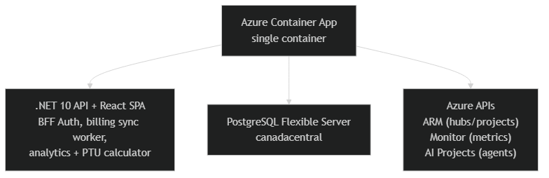

# Deploy

## Prerequisites

- [Azure Developer CLI (azd)](https://aka.ms/azd)
- [Azure CLI (az)](https://learn.microsoft.com/en-us/cli/azure/install-azure-cli)
- [Terraform >= 1.5](https://developer.hashicorp.com/terraform/downloads)

## 1. Provision Infrastructure

```bash
az login --tenant <your-tenant-id>
azd auth login --tenant-id <your-tenant-id>
azd init    # first time only — creates .azure/ env
azd env set AZURE_LOCATION canadacentral
azd env set AZURE_SUBSCRIPTION_ID <subscription-id>
azd env set AZURE_TENANT_ID <tenant-id>
azd up
```

This provisions: Resource Group, Container Apps Environment, PostgreSQL Flexible Server, Key Vault, Managed Identity with RBAC, and a Container App pulling from `ghcr.io/seiggy/foundry-billing:latest`.

## 2. Configure Entra ID Authentication (Post-Deploy)

After `azd up` completes, you need to create an Entra app registration for the BFF auth flow.

### 2a. Get your Container App URL

```bash
azd env get-values | grep APP_URL
# or
az containerapp show -n <container-app-name> -g <resource-group> --query "properties.configuration.ingress.fqdn" -o tsv
```

### 2b. Create the App Registration

1. Go to [Azure Portal → Microsoft Entra ID → App registrations → New registration](https://portal.azure.com/#view/Microsoft_AAD_RegisteredApps/CreateApplicationBlade)
2. **Name:** `Foundry Billing Portal`
3. **Supported account types:** "Accounts in this organizational directory only" (single tenant)
4. **Redirect URI:** Web → `https://<your-container-app-fqdn>/auth/callback`
5. Click **Register**

### 2c. Create a Client Secret

1. In the app registration → **Certificates & secrets** → **New client secret**
2. Description: `foundry-billing`, Expires: 12 months
3. Copy the **Value** (you won't see it again)

### 2d. Add localhost redirect (for local dev)

1. In **Authentication** → **Add a platform** → Web
2. Add redirect URI: `https://localhost:7220/auth/callback`

### 2e. Configure the Container App

Set the Entra config as Container App secrets/env vars:

```bash
RESOURCE_GROUP=$(azd env get-values | grep AZURE_RESOURCE_GROUP | cut -d'=' -f2 | tr -d '"')
APP_NAME=$(az containerapp list -g $RESOURCE_GROUP --query "[0].name" -o tsv)
CLIENT_ID="<from step 2b — Application (client) ID>"
CLIENT_SECRET="<from step 2c — secret value>"
TENANT_ID="<your tenant ID>"

az containerapp secret set -n $APP_NAME -g $RESOURCE_GROUP \
  --secrets "entra-client-secret=$CLIENT_SECRET"

az containerapp update -n $APP_NAME -g $RESOURCE_GROUP \
  --set-env-vars \
    "AzureAd__ClientId=$CLIENT_ID" \
    "AzureAd__ClientSecret=secretref:entra-client-secret" \
    "AzureAd__TenantId=$TENANT_ID"
```

### 2f. Configure for Local Development

Add to user secrets (never commit these):

```bash
cd src/FoundryBilling.Api
dotnet user-secrets set "AzureAd:TenantId" "<tenant-id>"
dotnet user-secrets set "AzureAd:ClientId" "<client-id>"
dotnet user-secrets set "AzureAd:ClientSecret" "<client-secret>"
```

## 3. Configure Azure Billing Access

The Managed Identity created by Terraform already has Reader + Monitoring Reader + Cognitive Services User on the subscription. For local dev, ensure your `az login` identity has the same roles.

```bash
cd src/FoundryBilling.Api
dotnet user-secrets set "Azure:SubscriptionId" "<subscription-id>"
dotnet user-secrets set "Azure:TenantId" "<tenant-id>"
```

## Architecture



## Notes

- Container image: `ghcr.io/seiggy/foundry-billing:latest` (built by GitHub Actions on push to main)
- Terraform state is local — each deployer manages their own `.tfstate`
- The sync worker polls Azure Monitor every 60 minutes (configurable via `Sync:IntervalMinutes`)
- Health endpoints (`/health`, `/alive`) are unauthenticated for Container Apps probes
