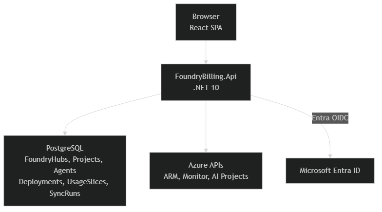

# Foundry Billing

Unified billing observability portal for Azure AI Foundry hubs, projects, deployments, and agents.

## Interface snapshot

This repository does not include screenshots. The current UI has six pages:

- **Dashboard** — total token summary cards, model breakdown, and the latest deployment usage slices.
- **Projects** — hub inventory, per-hub deployment and project counts, and the project-to-hub map.
- **Agents** — discovered agent inventory with project, hub, kind, model, creation time, and sync time filters.
- **Analytics** — 30/60/90 day usage windows with daily burn charts, model mix, and top deployment tables.
- **PTU Calc** — TPM baseline table, per-model override inputs, sizing output, and cost comparison across purchase modes.
- **Sync** — current worker status, manual trigger action, and recent sync run history.

## Features

- **Azure discovery sync** — discovers Azure AI Foundry hubs, projects, deployments, and agents from ARM, Azure Monitor, and the Azure AI Projects SDK.
- **Usage analytics** — exposes 30, 60, and 90 day views with daily usage points, model aggregates, and deployment breakdowns.
- **PTU calculator** — calculates TPM baselines, PTU sizing, and monthly cost comparisons for Global, DataZone, and Regional deployment pricing.
- **Sync operations** — runs on startup, repeats on a schedule, supports manual trigger, and records run history.
- **Entra ID BFF authentication** — uses server-side OpenID Connect with an HttpOnly cookie session; the browser never stores access tokens.
- **Aspire local orchestration** — starts PostgreSQL, the API, and the Vite frontend together for local development.
- **Azure deployment path** — provisions Azure Container Apps, PostgreSQL Flexible Server, Key Vault, and managed identity via `azd` and Terraform.

## Tech stack

- **.NET 10 / ASP.NET Core Minimal APIs** (`net10.0`, `Microsoft.AspNetCore.OpenApi` 10.0.9)
- **Entity Framework Core 10** with **Npgsql / Aspire PostgreSQL integration** 13.4.5
- **React 19.2.6** + **TypeScript 6.0.2** + **Vite 8.0.12**
- **Recharts 3.8.1** for dashboard visualizations
- **PostgreSQL 17**
- **.NET Aspire 13.4.5** AppHost orchestration
- **Terraform >= 1.5** with **AzureRM ~> 4.0**
- **Azure SDKs** for ARM, Azure Monitor, Azure AI Projects, and Entra ID integration

## Architecture overview



More detail: [docs/architecture.md](docs/architecture.md)

## Quick start

### Prerequisites

- .NET 10 SDK
- Node.js 22+
- Docker Desktop or another local Docker engine
- Aspire CLI / Aspire workload
- Azure CLI authenticated to the tenant you want to observe

### Clone and run

```bash
git clone https://github.com/seiggy/foundry-billing.git
cd foundry-billing
```

Configure local secrets for Azure discovery and Entra sign-in:

```bash
cd src/FoundryBilling.Api
dotnet user-secrets set "Azure:SubscriptionId" "<subscription-id>"
dotnet user-secrets set "Azure:TenantId" "<tenant-id>"
dotnet user-secrets set "AzureAd:TenantId" "<tenant-id>"
dotnet user-secrets set "AzureAd:ClientId" "<entra-app-client-id>"
dotnet user-secrets set "AzureAd:ClientSecret" "<entra-app-client-secret>"
cd ../..
```

Start the distributed app from the repository root:

```bash
aspire run
```

Notes:

- The AppHost starts PostgreSQL, the API, and the Vite frontend together.
- If the frontend dependencies have not been restored yet, run `npm install` once in `src/web` and re-run `aspire run`.
- The API uses the local HTTPS callback path `https://localhost:7220/auth/callback`, so your Entra app registration must allow it.

### Trigger the first sync

1. Open the web endpoint from the Aspire dashboard.
2. Sign in with an account that can read the target subscription and Azure Monitor metrics.
3. Go to **Sync**.
4. Click **Run Sync Now**.
5. Wait for the status card and run history table to show a completed sync.

## Deployment

Cloud deployment uses `azd` with Terraform-backed infrastructure in `infra/`.

- Short guide: [DEPLOY.md](DEPLOY.md)
- Expanded operations guide: [docs/deployment.md](docs/deployment.md)

## Documentation

Full project documentation lives in [`docs/`](docs/index.md):

- [Documentation home](docs/index.md)
- [Architecture](docs/architecture.md)
- [Configuration](docs/configuration.md)
- [API reference](docs/api-reference.md)
- [Development guide](docs/development.md)
- [Deployment guide](docs/deployment.md)
- [PTU calculator](docs/ptu-calculator.md)

## Contributing

- Keep endpoint, model, and configuration documentation in sync with code changes.
- Run backend tests before opening a PR: `dotnet test tests/FoundryBilling.Api.Tests/FoundryBilling.Api.Tests.csproj`
- For frontend changes, run `npm run lint` and `npm run build` in `src/web`.

## License

MIT
